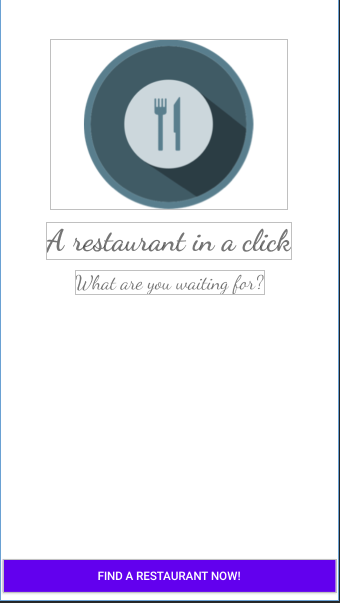
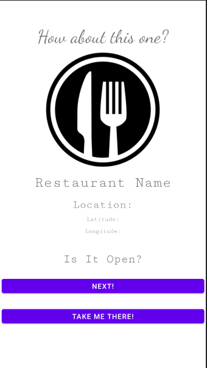

<h1 align="center" style=font-size:50px>
RandoFood
</h1>

# About my Project

Welcome to RandoFood! RandoFood is an Android app that is designed to reduce your anxiety when you don't know what restaurant to decide; it will show you the nearest random restaurant near you and guide you there. Please have a look at my app!

# App Layout

  
  

## Built With

My project was built using the following technologies:

- Kotlin
- Google Place API

# How to Build This Project

## Prerequisites

In order to run this app locally, you will need the following technologies:

- Android Studio and the Android emulators that come with it
- A Google API Key with the Places API enabled

If you don't have Android Studio, here's a [guide](https://developer.android.com/studio/install) to set it up.
If you don't have a an API Key, here's a another [guide](https://developer.android.com/studio/install) to set it up.

## Installation

1. Clone this repository and open the repo folder using Android Studio
2. Build the app
3. After building the app, the local.properties folder should show up. In there, you need to insert the Google API key by putting the following in the file: `GOOGLE_KEY=<YOUR API KEY HERE>`
4. Once that's done, build the app again and run the app using an Android emulator
